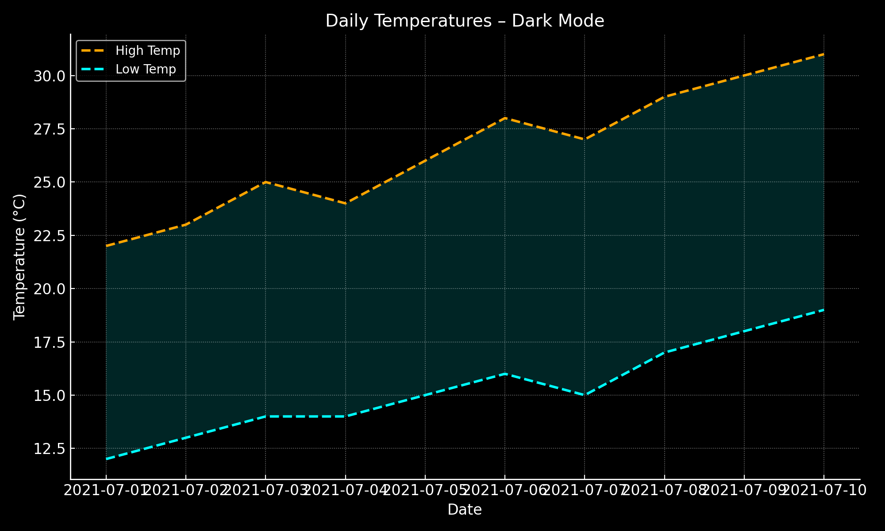

# 🌡️ Daily Temperature Visualization with Python

This project analyzes and visualizes daily weather data from various locations using Python, CSV data parsing, and Matplotlib visualizations.

---

## 📌 Project Overview

The project works with three weather datasets containing daily maximum and minimum temperatures from:

- **Sitka, Alaska – July 2021**
- **Sitka, Alaska – Full year of 2021**
- **Death Valley, California – Full year of 2021**

The goals of the project are:

- 🔍 Read and process weather data from CSV files  
- 📈 Generate line plots of max and min temperatures  
- 🌫️ Add a shaded area between temperature lines when enabled  
- 🧠 Structure the code modularly for clarity and reuse  

---

## 🧰 Technologies Used

- 🐍 Python 3.11+  
- 📦 `csv`, `datetime`, `os`  
- 📊 `matplotlib`  
- ⚙️ Modular design:  
  - `Dataset.py`: Enum paths to the datasets  
  - `temperatureEntry.py`: Data loading and visualization functions  
  - `graph.py`: Graph utilities  

---

## 📈 Example Output

> 🖼️ Example graph using dark mode:



---

## 🚀 How to Run

1. Clone the repository:
```bash
git clone https://github.com/your-username/temperature-visualization.git
cd temperature-visualization
```

2. Run the Jupyter Notebook:
```bash
jupyter notebook solution.ipynb
```

3. Or run directly in Python:
```python
from temperatureEntry import plotar_temperaturas
from Dataset import Dataset

plotar_temperaturas(Dataset.SITKA_2021, show_low_temp=True)
```

---

## 🎯 Key Learnings

- Reading and parsing CSV data with Python  
- Modular project structure using Enums  
- Building customizable visualizations with Matplotlib  
- Enhancing code reusability and clarity with well-defined functions  

---

## 📂 Project Structure

```
datasets/
├── sitka_weather_2021_simple.csv
├── sitka_weather_07-2021_simple.csv
└── death_valley_2021_simple.csv

Dataset.py
graph.py
temperatureEntry.py
solution.ipynb
README.md
sample_temperature_plot_dark.png
```

---

## 🧑‍💻 Author

**Leticia Paulino**  
[LinkedIn](https://www.linkedin.com/in/paulino-leticia/) · [GitHub](https://github.com/letpaulino)

---

> ⭐ If you found this project helpful, consider giving it a star!